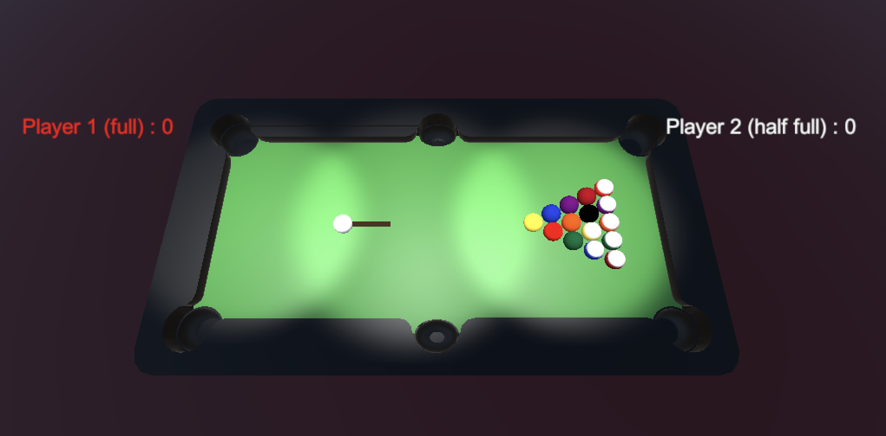

# Billiard 3D with Unity

Simple billiard game with balls and turn management. Blender object imported.

# Contribution

This project is copied and updated from [here.](https://github.com/stevenliatti/billiard_unity)

Feel free to fork and make the changes you want.
